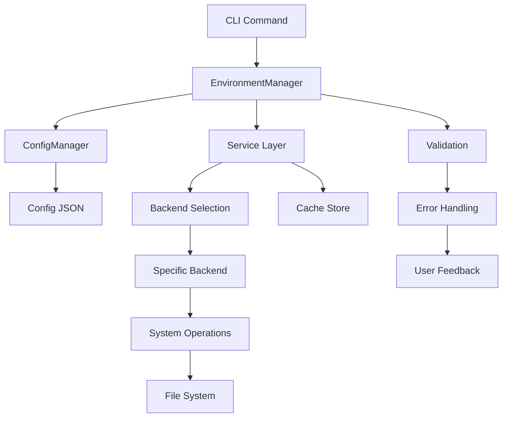
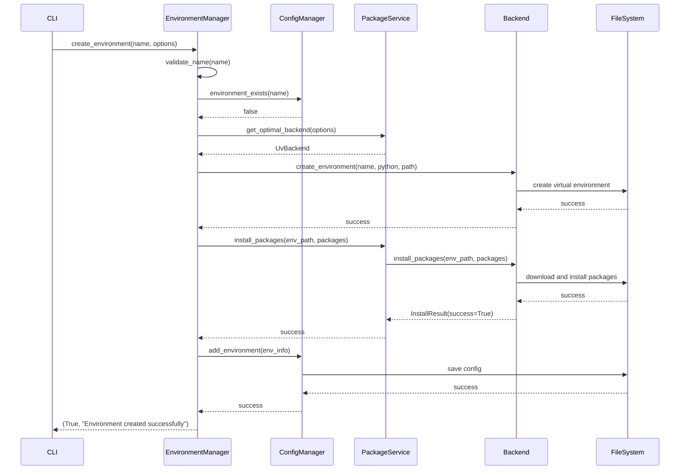

# 📋 Spécifications Fonctionnelles - GestVenv v1.1

**Version** : 1.1.0  
**Date** : 2025-01-27  
**Statut** : Final  
**Équipe** : GestVenv Core Team  

---

## 1. Vision Générale

### 1.1 Objectif du Système

GestVenv v1.1 est un gestionnaire d'environnements virtuels Python moderne qui simplifie et centralise la gestion des environnements de développement Python. Cette version apporte un support natif pour les standards Python modernes (pyproject.toml) et une architecture multi-backend pour des performances optimisées.

### 1.2 Périmètre Fonctionnel

**Fonctionnalités Core :**
- Création, activation, suppression d'environnements virtuels
- Installation, mise à jour, suppression de packages
- Support des formats requirements.txt ET pyproject.toml
- Backends multiples (pip, uv, poetry, pdm) avec sélection automatique
- Cache intelligent pour mode hors ligne
- Migration automatique depuis v1.0

**Fonctionnalités Avancées :**
- Groupes de dépendances (dev, test, docs, etc.)
- Lock files et synchronisation
- Templates et alias d'environnements
- Monitoring de performance et sécurité
- Export/import multi-formats
- Interface CLI intuitive et extensible

### 1.3 Utilisateurs Cibles

1. **Développeurs Python occasionnels** : Interface simple, migration transparente
2. **Développeurs Python réguliers** : Workflow efficace, gains de performance
3. **Équipes de développement** : Partage de configurations, cohérence
4. **DevOps/CI-CD** : Reproductibilité, automation, templates

---

## 2. Exigences Fonctionnelles

### 2.1 Gestion des Environnements Virtuels

#### RF-001 : Création d'Environnements
**Priorité** : Critique  
**Description** : Permettre la création d'environnements virtuels avec des options avancées.

**Critères d'Acceptation :**
- ✅ Création avec nom, version Python, packages initiaux
- ✅ Création depuis pyproject.toml avec groupes de dépendances
- ✅ Sélection automatique ou manuelle du backend (pip/uv/poetry/pdm)
- ✅ Validation du nom d'environnement (caractères autorisés, longueur)
- ✅ Chemin personnalisé ou répertoire par défaut
- ✅ Mode hors ligne utilisant le cache local

**Scénarios d'Usage :**
```bash
# Création simple
gestvenv create myproject

# Création avancée
gestvenv create myproject --python 3.11 --packages "flask,pytest"

# Depuis pyproject.toml
gestvenv create-from-pyproject ./pyproject.toml myproject --groups dev,test

# Avec backend spécifique
gestvenv create myproject --backend uv --python 3.11
```

#### RF-002 : Activation/Désactivation
**Priorité** : Critique  
**Description** : Gérer l'état actif des environnements avec commandes système.

**Critères d'Acceptation :**
- ✅ Commande d'activation générant les instructions shell appropriées
- ✅ Suivi de l'environnement actif dans la configuration
- ✅ Désactivation avec nettoyage de l'état
- ✅ Vérification de l'intégrité avant activation
- ✅ Messages d'aide pour l'activation manuelle

#### RF-003 : Suppression d'Environnements
**Priorité** : Élevée  
**Description** : Supprimer les environnements avec vérifications de sécurité.

**Critères d'Acceptation :**
- ✅ Suppression sécurisée avec validation du chemin
- ✅ Confirmation utilisateur (sauf mode --force)
- ✅ Nettoyage de la configuration et des alias
- ✅ Protection contre la suppression de répertoires système
- ✅ Sauvegarde optionnelle avant suppression

#### RF-004 : Listage et Informations
**Priorité** : Élevée  
**Description** : Visualiser les environnements avec leurs détails.

**Critères d'Acceptation :**
- ✅ Liste tous les environnements avec statut (actif/inactif/manquant)
- ✅ Informations détaillées par environnement (packages, santé, stats)
- ✅ Filtrage par backend, tags, état de santé
- ✅ Format d'affichage adaptatif (tableau/JSON)
- ✅ Indicateurs visuels colorés

### 2.2 Gestion des Packages

#### RF-005 : Installation de Packages
**Priorité** : Critique  
**Description** : Installer des packages avec support multi-backend et modes avancés.

**Critères d'Acceptation :**
- ✅ Installation simple : `gestvenv install myenv "requests,flask"`
- ✅ Installation depuis pyproject.toml avec groupes
- ✅ Mode hors ligne utilisant le cache
- ✅ Installation éditable pour développement local
- ✅ Gestion des extras et markers d'environnement
- ✅ Parallélisation pour backends supportant (uv)

#### RF-006 : Mise à Jour de Packages
**Priorité** : Élevée  
**Description** : Mettre à jour les packages avec stratégies flexibles.

**Critères d'Acceptation :**
- ✅ Mise à jour sélective ou complète (--all)
- ✅ Stratégies : only-if-needed, eager, to-latest
- ✅ Vérification des mises à jour disponibles
- ✅ Rapport des changements effectués
- ✅ Rollback en cas de problème

#### RF-007 : Désinstallation de Packages
**Priorité** : Moyenne  
**Description** : Désinstaller des packages avec gestion des dépendances.

**Critères d'Acceptation :**
- ✅ Désinstallation simple et par lots
- ✅ Vérification des dépendances avant suppression
- ✅ Avertissement pour packages requis par d'autres
- ✅ Option force pour forcer la suppression
- ✅ Nettoyage des packages orphelins

### 2.3 Support pyproject.toml

#### RF-008 : Parsing pyproject.toml
**Priorité** : Critique  
**Description** : Parser et interpréter les fichiers pyproject.toml conformément aux PEP.

**Critères d'Acceptation :**
- ✅ Support complet PEP 621 (métadonnées projet)
- ✅ Parsing des dépendances principales et optionnelles
- ✅ Gestion des sections [tool.xyz] pour différents outils
- ✅ Validation syntaxe TOML et structure
- ✅ Messages d'erreur explicites et localisés

#### RF-009 : Synchronisation avec pyproject.toml
**Priorité** : Élevée  
**Description** : Synchroniser les environnements avec les fichiers pyproject.toml.

**Critères d'Acceptation :**
- ✅ Commande `gestvenv sync` détectant les changements
- ✅ Installation/suppression automatique selon modifications
- ✅ Gestion des groupes de dépendances (dev, test, docs)
- ✅ Mode strict supprimant packages non déclarés
- ✅ Mise à jour des lock files si supporté

#### RF-010 : Conversion requirements ↔ pyproject
**Priorité** : Moyenne  
**Description** : Convert entre formats requirements.txt et pyproject.toml.

**Critères d'Acceptation :**
- ✅ Conversion requirements.txt → pyproject.toml
- ✅ Détection automatique fichiers multiples (dev-requirements.txt)
- ✅ Export pyproject.toml → requirements.txt
- ✅ Préservation des spécificateurs de version
- ✅ Génération métadonnées projet basiques

### 2.4 Backends Multiples

#### RF-011 : Support Backend pip
**Priorité** : Critique  
**Description** : Backend pip avec fonctionnalités complètes (compatibilité v1.0).

**Critères d'Acceptation :**
- ✅ Toutes opérations pip standard (install, update, uninstall)
- ✅ Support requirements.txt natif
- ✅ Configuration index URL, trusted hosts
- ✅ Compatibilité 100% avec environnements v1.0
- ✅ Gestion des caches pip existants

#### RF-012 : Support Backend uv
**Priorité** : Élevée  
**Description** : Backend uv pour performances optimisées.

**Critères d'Acceptation :**
- ✅ Détection automatique disponibilité uv
- ✅ Création environnements avec `uv venv`
- ✅ Installation packages avec `uv pip install`
- ✅ Support pyproject.toml natif avec `uv pip sync`
- ✅ Performance ≥ 5x plus rapide que pip
- ✅ Génération et gestion uv.lock

#### RF-013 : Sélection Automatique Backend
**Priorité** : Élevée  
**Description** : Sélection intelligente du backend selon le contexte.

**Critères d'Acceptation :**
- ✅ Détection type projet (uv.lock → uv, requirements.txt → pip)
- ✅ Préférence utilisateur configurable
- ✅ Fallback automatique si backend indisponible
- ✅ Messages informatifs sur backend utilisé
- ✅ Option force backend par commande

### 2.5 Cache et Mode Hors Ligne

#### RF-014 : Cache Intelligent
**Priorité** : Élevée  
**Description** : Système de cache pour packages et métadonnées.

**Critères d'Acceptation :**
- ✅ Cache automatique lors des téléchargements
- ✅ Cache séparé par backend (éviter collisions)
- ✅ Gestion taille maximale et âge des packages
- ✅ Commandes de gestion cache (list, clean, info)
- ✅ Vérification intégrité (checksums)

#### RF-015 : Mode Hors Ligne
**Priorité** : Élevée  
**Description** : Fonctionnement complet sans connexion internet.

**Critères d'Acceptation :**
- ✅ Création environnements avec packages cachés uniquement
- ✅ Validation disponibilité packages avant création
- ✅ Messages explicites si packages manquants
- ✅ Mode global ou par commande
- ✅ Pré-cache de packages populaires

### 2.6 Export/Import et Partage

#### RF-016 : Export Multi-Format
**Priorité** : Élevée  
**Description** : Export des configurations en plusieurs formats.

**Critères d'Acceptation :**
- ✅ Export JSON (format complet avec métadonnées)
- ✅ Export requirements.txt (compatibilité universelle)
- ✅ Export pyproject.toml (standard moderne)
- ✅ Inclusion métadonnées : auteur, date, version GestVenv
- ✅ Options de filtrage (groupes, packages dev/prod)

#### RF-017 : Import Multi-Source
**Priorité** : Élevée  
**Description** : Import depuis diverses sources de configuration.

**Critères d'Acceptation :**
- ✅ Import JSON GestVenv (v1.0 et v1.1)
- ✅ Import requirements.txt standard
- ✅ Import pyproject.toml avec sélection groupes
- ✅ Validation et migration automatique
- ✅ Gestion des conflits et écrasement

### 2.7 Migration et Compatibilité

#### RF-018 : Migration Automatique v1.0 → v1.1
**Priorité** : Critique  
**Description** : Migration transparente des configurations existantes.

**Critères d'Acceptation :**
- ✅ Détection automatique configurations v1.0
- ✅ Migration sans perte de données
- ✅ Sauvegarde automatique avant migration
- ✅ Rollback possible en cas de problème
- ✅ Messages informatifs sur le processus

#### RF-019 : Compatibilité Ascendante
**Priorité** : Critique  
**Description** : Compatibilité 100% avec fonctionnalités v1.0.

**Critères d'Acceptation :**
- ✅ Toutes commandes CLI v1.0 fonctionnent identiquement
- ✅ Formats d'export/import v1.0 supportés
- ✅ Environnements v1.0 utilisables sans modification
- ✅ API Python v1.0 préservée et étendue
- ✅ Configuration v1.0 lue et convertie

---

## 3. Cas d'Usage Détaillés

### 3.1 Cas d'Usage : Développeur Débutant

**Acteur** : Développeur Python débutant  
**Objectif** : Créer son premier environnement pour un projet web

**Préconditions :**
- Python installé sur le système
- GestVenv v1.1 installé

**Scénario Principal :**
1. L'utilisateur veut créer un environnement pour apprendre Flask
2. Il exécute : `gestvenv create web_learning --packages flask`
3. GestVenv détecte automatiquement la version Python disponible
4. GestVenv sélectionne le backend optimal (uv si disponible, sinon pip)
5. L'environnement est créé avec Flask installé
6. L'utilisateur obtient les instructions pour activer l'environnement
7. Il peut commencer à développer immédiatement

**Scénarios Alternatifs :**
- Si uv n'est pas installé → fallback automatique vers pip
- Si connexion internet indisponible → utilisation du cache si Flask disponible
- Si nom environnement invalide → message d'erreur explicite avec suggestions

### 3.2 Cas d'Usage : Migration Projet Existant

**Acteur** : Développeur expérimenté avec projet existant  
**Objectif** : Migrer un projet requirements.txt vers pyproject.toml moderne

**Préconditions :**
- Projet existant avec requirements.txt et dev-requirements.txt
- GestVenv v1.1 installé

**Scénario Principal :**
1. L'utilisateur analyse son projet : `gestvenv migrate --analyze`
2. GestVenv détecte requirements.txt et dev-requirements.txt
3. GestVenv suggère la migration vers pyproject.toml
4. L'utilisateur lance : `gestvenv convert-to-pyproject requirements.txt`
5. GestVenv génère pyproject.toml avec groupes de dépendances appropriés
6. L'utilisateur crée l'environnement : `gestvenv create-from-pyproject pyproject.toml myproject`
7. GestVenv utilise uv pour des performances optimisées
8. L'environnement est créé avec toutes les dépendances correctement organisées

### 3.3 Cas d'Usage : Équipe DevOps

**Acteur** : Ingénieur DevOps  
**Objectif** : Standardiser les environnements pour l'équipe de développement

**Préconditions :**
- Environnements de développement hétérogènes dans l'équipe
- Besoin de reproductibilité pour CI/CD

**Scénario Principal :**
1. L'ingénieur crée un environnement de référence : `gestvenv create reference_env --from-pyproject ./pyproject.toml --groups dev,test,docs`
2. Il exporte la configuration : `gestvenv export reference_env --format json --output team_config.json`
3. Il crée un template : `gestvenv template create python_web team_config.json`
4. Les développeurs de l'équipe importent : `gestvenv import team_config.json my_local_env`
5. Tous les environnements sont identiques et reproductibles
6. Le CI/CD utilise le même processus pour cohérence

---

## 4. Exigences Non-Fonctionnelles

### 4.1 Performance

#### NFR-001 : Temps de Réponse CLI
**Métrique** : Commandes simples ≤ 200ms, complexes ≤ 2s  
**Justification** : Interface réactive pour usage interactif quotidien  
**Test** : Benchmark sur machines référence (SSD, 8GB RAM)

#### NFR-002 : Performance Installation uv
**Métrique** : Installation avec uv ≥ 5x plus rapide que pip  
**Justification** : Principal avantage de l'intégration uv  
**Test** : Installation 50 packages populaires, mesure temps total

#### NFR-003 : Consommation Mémoire
**Métrique** : Usage RAM ≤ 100MB pour opérations normales  
**Justification** : Compatible environnements contraints  
**Test** : Profiling mémoire avec outils système

### 4.2 Fiabilité

#### NFR-004 : Taux de Succès Opérations
**Métrique** : ≥ 99% opérations réussissent dans conditions normales  
**Justification** : Outil critique pour développement quotidien  
**Test** : Tests automatisés sur matrice environnements

#### NFR-005 : Récupération d'Erreur
**Métrique** : 100% opérations critiques ont rollback automatique  
**Justification** : Sécurité des données utilisateur  
**Test** : Injection d'erreurs pendant opérations sensibles

#### NFR-006 : Intégrité des Données
**Métrique** : 0% corruption configuration lors de pannes système  
**Justification** : Préservation du travail utilisateur  
**Test** : Simulation pannes pendant sauvegardes

### 4.3 Utilisabilité

#### NFR-007 : Courbe d'Apprentissage
**Métrique** : Utilisateur v1.0 utilise 80% fonctionnalités v1.1 en ≤ 15min  
**Justification** : Migration fluide sans friction  
**Test** : Tests utilisateurs avec chronométrage

#### NFR-008 : Messages d'Erreur
**Métrique** : 100% erreurs ont messages explicites avec suggestions  
**Justification** : Autonomie utilisateur, réduction support  
**Test** : Review messages + tests accessibilité

#### NFR-009 : Documentation Intégrée
**Métrique** : Toutes commandes ont --help complet avec exemples  
**Justification** : Auto-découverte fonctionnalités  
**Test** : Audit exhaustif aide CLI

### 4.4 Compatibilité

#### NFR-010 : Support Plateformes
**Métrique** : Fonctionnement sur Linux, macOS, Windows  
**Justification** : Multiplateforme comme v1.0  
**Test** : CI/CD matrix 3 OS × 5 versions Python

#### NFR-011 : Support Python
**Métrique** : Python 3.9, 3.10, 3.11, 3.12, 3.13  
**Justification** : Large compatibilité écosystème  
**Test** : Test suite complète chaque version

#### NFR-012 : Rétrocompatibilité
**Métrique** : 0% changement comportement utilisateur v1.0  
**Justification** : Préservation habitudes existantes  
**Test** : Regression tests complets

---

## 5. Contraintes

### 5.1 Contraintes Techniques

#### C-001 : Dépendances Minimales
**Contrainte** : Nouvelles dépendances ≤ 5MB impact installation  
**Justification** : Installation rapide, compatibilité environnements contraints  
**Validation** : Audit taille dépendances transitives

#### C-002 : Compatibilité TOML
**Contrainte** : Support TOML 1.0.0 complet avec fallback  
**Justification** : Standard moderne + compatibilité Python < 3.11  
**Validation** : Tests conformité spec TOML officielle

### 5.2 Contraintes Environnementales

#### C-003 : Fonctionnement Hors Ligne
**Contrainte** : Mode hors ligne fonctionnel pour opérations critiques  
**Justification** : Utilisateurs en environnements restreints/mobiles  
**Validation** : Tests sans connexion internet

#### C-004 : Support Systèmes Restreints
**Contrainte** : Fonctionnement sans backends avancés (uv/poetry)  
**Justification** : Pas d'exclusion utilisateurs environnements contraints  
**Validation** : Tests containers Alpine/Ubuntu minimal

### 5.3 Contraintes Réglementaires

#### C-005 : Licences Open Source
**Contrainte** : Toutes dépendances compatibles licence MIT  
**Justification** : Distribution libre sans restrictions  
**Validation** : Audit licences automatisé

#### C-006 : Sécurité Données
**Contrainte** : Aucune donnée sensible stockée ou transmise  
**Justification** : Confidentialité développeurs  
**Validation** : Audit sécurité + tests penetration

---

## 6. Critères d'Acceptation Globaux

### 6.1 Critères de Livraison

| Critère | Seuil Minimum | Objectif | Méthode de Test |
|---------|---------------|----------|-----------------|
| Couverture Tests | 85% | 90% | pytest-cov |
| Performance uv | 5x pip | 10x pip | Benchmark 50 packages |
| Compatibilité v1.0 | 100% | 100% | Suite régression |
| Satisfaction Utilisateur | 4.0/5 | 4.5/5 | Enquête beta testeurs |
| Temps Réponse CLI | ≤ 200ms | ≤ 100ms | Tests automatisés |

### 6.2 Validation Finale

#### Tests d'Acceptation Utilisateur
- 50+ beta testeurs sur 4+ semaines
- Tests sur projets réels open-source
- Validation workflows équipes

#### Tests de Charge
- 1000+ environnements simultanés
- Installation packages lourds (ML/Data Science)
- Stabilité mémoire 48h+

#### Tests de Sécurité
- Validation chemins et commandes système
- Tests injection dans noms environnements
- Audit permissions fichiers créés

---

## 7. Évolution Future

### 7.1 Fonctionnalités Prévues v1.2

- **Templates Avancés** : Templates avec variables, conditions
- **Interface Web** : Interface graphique locale optionnelle
- **Collaboration** : Partage configurations cloud
- **Analytics** : Métriques usage et optimisations
- **Multi-Langage** : Support Node.js, Rust, Go

### 7.2 Roadmap Long Terme

- **v1.3** : Intégration IDE (VS Code, PyCharm)
- **v1.4** : Support conteneurs (Docker, Podman)  
- **v2.0** : Architecture distribuée et plugins tiers

Cette spécification fonctionnelle constitue le contrat entre l'équipe de développement et les utilisateurs pour GestVenv v1.1, garantissant une évolution moderne tout en préservant la simplicité et robustesse qui font le succès de l'outil.

---

# 🏗️ Conception Architecturale - GestVenv v1.1

**Version** : 1.1.0  
**Date** : 2025-01-27  
**Statut** : Final  
**Équipe** : GestVenv Architecture Team  

---

## 1. Vue d'Ensemble Architecturale

### 1.1 Principes Directeurs

**Architecture Modulaire**
- Séparation claire des responsabilités
- Couplage faible, cohésion forte
- Extensibilité via interfaces abstraites
- Testabilité de chaque composant

**Compatibilité et Évolution**
- Compatibilité ascendante stricte (v1.0 → v1.1)
- Migration automatique et transparente
- API stable et extensible
- Dépréciation progressive et documentée

**Performance et Fiabilité**
- Backends optimisés (uv 10x plus rapide que pip)
- Cache intelligent multi-niveaux
- Gestion d'erreurs robuste avec rollback
- Monitoring et métriques intégrés

### 1.2 Architecture Générale

```
┌─────────────────────────────────────────────────────────────────┐
│                        GESTVENV v1.1                           │
│                     Interface Utilisateur                      │
├─────────────────────────────────────────────────────────────────┤
│  CLI (cli.py)  │  API Python  │  Future: Web UI  │  Future: IDE│
├─────────────────────────────────────────────────────────────────┤
│                        COUCHE CORE                              │
├─────────────────────────────────────────────────────────────────┤
│  EnvironmentManager  │  ConfigManager  │  Models & Validation  │
├─────────────────────────────────────────────────────────────────┤
│                      COUCHE SERVICES                           │
├─────────────────────────────────────────────────────────────────┤
│ Environment │ Package │ System │ Cache │ Migration │ Security  │
│  Service    │ Service │Service │Service│  Service  │ Service   │
├─────────────────────────────────────────────────────────────────┤
│                     COUCHE BACKENDS                            │
├─────────────────────────────────────────────────────────────────┤
│  BaseBackend │ PipBackend │ UvBackend │ Poetry │ PDM │ Future │
├─────────────────────────────────────────────────────────────────┤
│                    COUCHE UTILITAIRES                          │
├─────────────────────────────────────────────────────────────────┤
│ Path │ System │ Format │ Validation │ TOML │ PyProject │ Cache │
│Utils │ Utils  │ Utils  │   Utils    │Utils │  Parser   │ Utils │
├─────────────────────────────────────────────────────────────────┤
│                   COUCHE PERSISTANCE                           │
├─────────────────────────────────────────────────────────────────┤
│  Config JSON  │  Cache Store  │  Lock Files  │  Backup Store  │
└─────────────────────────────────────────────────────────────────┘
```

### 1.3 Flux de Données Principal



---

## 2. Architecture des Composants

### 2.1 Couche Core

#### 2.1.1 EnvironmentManager
**Responsabilité** : Orchestration des opérations sur les environnements virtuels

**Interfaces Publiques :**
```python
class EnvironmentManager:
    def create_environment(self, name: str, **options) -> Tuple[bool, str]
    def activate_environment(self, name: str) -> Tuple[bool, str]
    def delete_environment(self, name: str, force: bool = False) -> Tuple[bool, str]
    def list_environments(self, **filters) -> List[Dict[str, Any]]
    def sync_environment(self, name: str, **options) -> Tuple[bool, str]
    def clone_environment(self, source: str, target: str) -> Tuple[bool, str]
    def export_environment(self, name: str, **options) -> Tuple[bool, str]
    def import_environment(self, source: str, **options) -> Tuple[bool, str]
```

**Dépendances :**
- ConfigManager : Persistance et configuration
- Services : Opérations spécialisées
- Backends : Exécution des opérations packages

#### 2.1.2 ConfigManager
**Responsabilité** : Gestion centralisée de la configuration et persistance

**Interfaces Publiques :**
```python
class ConfigManager:
    def get_environment(self, name: str) -> Optional[EnvironmentInfo]
    def add_environment(self, env_info: EnvironmentInfo) -> bool
    def update_environment(self, env_info: EnvironmentInfo) -> bool
    def remove_environment(self, name: str) -> bool
    def set_active_environment(self, name: str) -> bool
    def get_setting(self, key: str, default: Any = None) -> Any
    def set_setting(self, key: str, value: Any) -> bool
    def export_config(self, output_path: str) -> bool
    def import_config(self, input_path: str) -> bool
```

**Fonctionnalités Avancées :**
- Migration automatique v1.0 → v1.1
- Sauvegarde et restauration
- Validation et réparation
- Templates et alias

#### 2.1.3 Models
**Responsabilité** : Structures de données et validation

**Classes Principales :**
```python
@dataclass
class EnvironmentInfo:
    name: str
    path: Path
    python_version: str
    backend_type: BackendType
    source_file_type: SourceFileType
    pyproject_info: Optional[PyProjectInfo]
    health: EnvironmentHealth
    # ... autres champs v1.1

@dataclass  
class PyProjectInfo:
    name: str
    dependencies: List[str]
    optional_dependencies: Dict[str, List[str]]
    build_system: Dict[str, Any]
    # ... champs PEP 621

@dataclass
class BackendCapabilities:
    supports_lock_files: bool
    supports_dependency_groups: bool
    supports_parallel_install: bool
    # ... autres capacités
```

### 2.2 Couche Services

#### 2.2.1 EnvironmentService
**Responsabilité** : Operations spécialisées sur les environnements

```python
class EnvironmentService:
    def create_environment(self, name: str, python_cmd: str, path: Path) -> Tuple[bool, str]
    def check_environment_health(self, name: str, path: Path) -> EnvironmentHealth
    def validate_environment_name(self, name: str) -> Tuple[bool, str]
    def get_activation_script_path(self, name: str, path: Path) -> Optional[Path]
    def is_safe_to_delete(self, name: str, path: Path) -> Tuple[bool, str]
```

#### 2.2.2 PackageService  
**Responsabilité** : Gestion unifie des packages multi-backend

```python
class PackageService:
    def __init__(self):
        self.backends = {
            BackendType.PIP: PipBackend(),
            BackendType.UV: UvBackend(),
            # ... autres backends
        }
    
    def get_optimal_backend(self, env_name: str) -> PackageBackend
    def install_packages(self, env_name: str, packages: List[str]) -> Tuple[bool, str]
    def install_from_pyproject(self, env_name: str, pyproject_path: Path) -> Tuple[bool, str]
    def sync_environment(self, env_name: str, **options) -> Tuple[bool, str]
```

**Algorithme de Sélection Backend :**
1. Backend explicitement spécifié → utiliser si disponible
2. Détection projet (uv.lock → uv, poetry.lock → poetry)
3. Préférence utilisateur configurée
4. Ordre par défaut : uv > pip > poetry > pdm
5. Fallback : pip (toujours disponible)

#### 2.2.3 SystemService
**Responsabilité** : Interactions système et commandes shell

```python
class SystemService:
    def run_command(self, cmd: List[str], **options) -> Dict[str, Any]
    def get_activation_command(self, env_name: str, env_path: Path) -> Optional[str]
    def run_in_environment(self, env_name: str, env_path: Path, command: List[str]) -> Tuple[int, str, str]
    def check_python_version(self, python_cmd: str) -> Optional[str]
    def get_available_python_versions(self) -> List[Dict[str, str]]
```

### 2.3 Couche Backends

#### 2.3.1 Architecture Backend

```python
class PackageBackend(ABC):
    @property
    @abstractmethod
    def name(self) -> str: pass
    
    @property
    @abstractmethod
    def capabilities(self) -> BackendCapabilities: pass
    
    @abstractmethod
    def is_available(self) -> bool: pass
    
    @abstractmethod
    def create_environment(self, name: str, python_version: str, path: Path) -> bool: pass
    
    @abstractmethod
    def install_packages(self, env_path: Path, packages: List[str]) -> InstallResult: pass
    
    @abstractmethod
    def sync_from_pyproject(self, env_path: Path, pyproject_path: Path) -> bool: pass
```

#### 2.3.2 Backend Spécialisés

**PipBackend** : Backend de référence et fallback
- Compatibilité 100% avec v1.0
- Support requirements.txt natif
- Gestion configuration pip (index-url, trusted-hosts)

**UvBackend** : Backend haute performance
- Performances 5-10x supérieures à pip
- Support pyproject.toml natif
- Génération automatique uv.lock
- Installation parallèle

**PoetryBackend** : Support écosystème Poetry
- Gestion poetry.lock
- Support groupes de dépendances Poetry
- Intégration build system

### 2.4 Couche Utilitaires

#### 2.4.1 PyProjectParser
**Responsabilité** : Parsing et manipulation pyproject.toml

```python
class PyProjectParser:
    def __init__(self, path: Path)
    def extract_info(self) -> PyProjectInfo
    def get_dependencies(self, group: str = "main") -> List[str]  
    def get_all_dependency_groups(self) -> Dict[str, List[str]]
    def validate(self) -> List[ValidationError]
    def to_requirements_format(self, groups: List[str]) -> str
```

**Fonctionnalités :**
- Support TOML 1.0.0 complet
- Parsing PEP 621 (métadonnées projet)
- Gestion sections [tool.xyz]
- Validation syntaxe et sémantique
- Conversion bidirectionnelle requirements ↔ pyproject

#### 2.4.2 CacheService
**Responsabilité** : Cache intelligent multi-backend

```python
class CacheService:
    def add_package(self, package_path: Path, name: str, version: str) -> bool
    def get_package(self, name: str, version: Optional[str] = None) -> Optional[Path]
    def has_package(self, name: str, version: Optional[str] = None) -> bool
    def clean_cache(self, max_age_days: int, max_size_mb: int) -> Tuple[int, int]
    def get_cache_stats(self) -> Dict[str, Any]
```

**Architecture Cache :**
```
~/.config/gestvenv/cache/
├── packages/
│   ├── requests/
│   │   ├── requests-2.26.0-py3-none-any.whl
│   │   └── requests-2.27.1-py3-none-any.whl
│   └── flask/
├── metadata/
│   ├── index.json
│   └── dependencies.json
└── requirements/
    ├── hash1.txt
    └── hash2.txt
```

---

## 3. Modèles de Données

### 3.1 Structure Configuration

```json
{
  "config_version": "1.1.0",
  "migrated_from_version": "1.0.0",
  "migration_date": "2025-01-27T10:00:00",
  
  "environments": {
    "myproject": {
      "name": "myproject",
      "path": "/path/to/env",
      "python_version": "3.11.0",
      "backend_type": "uv",
      "source_file_type": "pyproject",
      "pyproject_info": { ... },
      "health": { ... },
      "aliases": ["mp", "main"],
      "tags": ["web", "production"],
      "last_used": "2025-01-27T15:30:00",
      "usage_count": 42
    }
  },
  
  "active_env": "myproject",
  "default_python": "python3",
  "preferred_backend": "uv",
  
  "backend_settings": {
    "pip": {
      "index_url": null,
      "extra_index_urls": [],
      "timeout": 60
    },
    "uv": {
      "resolution": "highest",
      "compile_bytecode": true
    }
  },
  
  "global_aliases": {
    "main": "myproject",
    "dev": "myproject_dev"
  },
  
  "templates": {
    "python_web": { ... },
    "data_science": { ... }
  },
  
  "settings": {
    "auto_activate": true,
    "offline_mode": false,
    "use_package_cache": true,
    "performance_monitoring": true
  }
}
```

### 3.2 Modèle PyProject

```python
@dataclass
class PyProjectInfo:
    # Métadonnées projet (PEP 621)
    name: str = ""
    version: str = "0.1.0"
    description: Optional[str] = None
    readme: Optional[str] = None
    requires_python: Optional[str] = None
    license: Optional[Dict[str, str]] = None
    authors: List[Dict[str, str]] = field(default_factory=list)
    
    # Dépendances
    dependencies: List[str] = field(default_factory=list)
    optional_dependencies: Dict[str, List[str]] = field(default_factory=dict)
    
    # Build system (PEP 517/518)
    build_system: Dict[str, Any] = field(default_factory=dict)
    
    # Sections outils
    tool_sections: Dict[str, Any] = field(default_factory=dict)
    
    # Métadonnées parsing
    file_path: Optional[Path] = None
    last_modified: Optional[datetime] = None
    parsed_at: Optional[datetime] = None
```

### 3.3 Modèle Santé Environnement

```python
@dataclass
class EnvironmentHealth:
    exists: bool = False
    python_available: bool = False
    pip_available: bool = False
    activation_script_exists: bool = False
    backend_available: bool = False
    lock_file_valid: bool = True
    dependencies_synchronized: bool = True
    security_issues: List[str] = field(default_factory=list)
    performance_score: Optional[float] = None
    last_health_check: Optional[datetime] = None
    
    @property
    def health_score(self) -> float:
        """Calcule score santé global (0.0-1.0)"""
        checks = [
            self.exists, self.python_available, self.pip_available,
            self.activation_script_exists, self.backend_available,
            self.lock_file_valid, self.dependencies_synchronized,
            len(self.security_issues) == 0
        ]
        return sum(checks) / len(checks)
    
    @property
    def is_healthy(self) -> bool:
        return self.health_score >= 0.8
```

---

## 4. Interfaces et APIs

### 4.1 Interface CLI

#### 4.1.1 Commandes Principales

```bash
# Gestion environnements
gestvenv create <name> [options]
gestvenv create-from-pyproject <pyproject> <name> [options]
gestvenv activate <name>
gestvenv deactivate
gestvenv delete <name> [--force]
gestvenv list [--verbose] [--filter]
gestvenv info <name>
gestvenv clone <source> <target>

# Gestion packages  
gestvenv install <env> <packages> [--backend] [--offline]
gestvenv uninstall <env> <packages>
gestvenv update <env> [packages] [--all]
gestvenv sync <env> [--groups] [--strict]
gestvenv add <env> <package> [--group]

# Export/Import
gestvenv export <env> [--format] [--output]
gestvenv import <file> [--name] [--force]
gestvenv convert-to-pyproject <requirements>

# Configuration
gestvenv config [--set-python] [--show]
gestvenv backend [list|set|info]
gestvenv cache [list|clean|info|add]

# Utilitaires
gestvenv check <env>
gestvenv run <env> <command>
gestvenv pyversions
gestvenv migrate [--analyze] [--convert]
```

#### 4.1.2 Options Globales

```bash
--debug          # Mode debug avec logs détaillés
--offline        # Mode hors ligne
--backend <name> # Force un backend spécifique
--config <path>  # Fichier de configuration personnalisé
--no-color       # Désactive les couleurs
--json          # Sortie au format JSON
--quiet         # Mode silencieux
--verbose       # Mode verbeux
```

### 4.2 API Python

#### 4.2.1 Interface Publique

```python
# gestvenv/__init__.py
from gestvenv import EnvironmentManager

# Usage basique
manager = EnvironmentManager()
success, message = manager.create_environment("myproject")

# Usage avancé
success, message = manager.create_environment(
    name="myproject",
    python_version="3.11",
    packages=["flask", "pytest"],
    backend=BackendType.UV,
    from_pyproject=Path("./pyproject.toml"),
    groups=["dev", "test"]
)

# Informations environnements
environments = manager.list_environments()
env_info = manager.get_environment_info("myproject")

# Opérations packages
success, message = manager.sync_environment("myproject", groups=["dev"])
success, updates, message = manager.check_for_updates("myproject")
```

#### 4.2.2 API Configuration

```python
from gestvenv import ConfigManager

config = ConfigManager()

# Paramètres généraux
config.set_setting("preferred_backend", "uv")
config.set_offline_mode(True)

# Paramètres backend
config.set_backend_setting("uv", "resolution", "highest")
config.set_backend_setting("pip", "timeout", 120)

# Alias et templates
config.add_global_alias("main", "myproject")
config.add_template("web_app", template_data)
```

### 4.3 Interface Backend

```python
class PackageBackend(ABC):
    """Interface que tous les backends doivent implémenter"""
    
    @abstractmethod
    def create_environment(self, name: str, python_version: str, path: Path) -> bool:
        """Crée un environnement virtuel"""
        
    @abstractmethod  
    def install_packages(self, env_path: Path, packages: List[str]) -> InstallResult:
        """Installe des packages"""
        
    @abstractmethod
    def sync_from_pyproject(self, env_path: Path, pyproject_path: Path) -> bool:
        """Synchronise avec pyproject.toml"""
        
    # Méthodes optionnelles avec implémentation par défaut
    def create_lock_file(self, env_path: Path, output_path: Path) -> bool:
        return False  # Pas supporté par défaut
        
    def supports_feature(self, feature: str) -> bool:
        return feature in self.capabilities.supported_features
```

---

## 5. Flux de Données et Algorithmes

### 5.1 Flux Création Environnement



### 5.2 Algorithme Sélection Backend

```python
def get_optimal_backend(self, env_name: Optional[str] = None, 
                       project_path: Optional[Path] = None,
                       explicit_backend: Optional[BackendType] = None) -> BackendType:
    
    # 1. Backend explicitement spécifié
    if explicit_backend and explicit_backend in self.available_backends:
        backend = self.available_backends[explicit_backend]
        if backend.is_available():
            return explicit_backend
        else:
            logger.warning(f"Backend {explicit_backend} spécifié mais non disponible")
    
    # 2. Backend basé sur l'environnement existant
    if env_name:
        env_info = self.config_manager.get_environment(env_name)
        if env_info and env_info.backend_type in self.available_backends:
            backend = self.available_backends[env_info.backend_type]
            if backend.is_available():
                return env_info.backend_type
    
    # 3. Détection basée sur le projet
    if project_path:
        detected_backend = self._detect_project_backend(project_path)
        if detected_backend and detected_backend in self.available_backends:
            backend = self.available_backends[detected_backend]
            if backend.is_available():
                return detected_backend
    
    # 4. Préférence utilisateur
    preferred = self.config_manager.get_preferred_backend()
    if preferred != BackendType.PIP and preferred in self.available_backends:
        backend = self.available_backends[preferred]
        if backend.is_available():
            return preferred
    
    # 5. Ordre de préférence par défaut
    preference_order = [BackendType.UV, BackendType.PIP, BackendType.POETRY, BackendType.PDM]
    for backend_type in preference_order:
        if backend_type in self.available_backends:
            backend = self.available_backends[backend_type]
            if backend.is_available():
                return backend_type
    
    # 6. Fallback ultime
    return BackendType.PIP
```

### 5.3 Gestion Cache Intelligent

```python
class CacheStrategy:
    def should_cache_package(self, package_name: str, size_bytes: int) -> bool:
        """Détermine si un package doit être mis en cache"""
        
        # Packages populaires : toujours cacher
        if package_name in POPULAR_PACKAGES:
            return True
            
        # Packages volumineux : cacher si espace disponible
        if size_bytes > 50 * 1024 * 1024:  # > 50MB
            return self.has_cache_space(size_bytes)
            
        # Packages moyens : cacher selon usage
        if self.get_package_usage_frequency(package_name) > 0.1:
            return True
            
        return False
    
    def evict_packages(self, required_space: int) -> List[str]:
        """Algorithme LRU avec priorités pour libérer de l'espace"""
        
        candidates = []
        for pkg_name, pkg_versions in self.cache_index.items():
            for version, metadata in pkg_versions.items():
                score = self._calculate_eviction_score(metadata)
                candidates.append((score, pkg_name, version, metadata['size']))
        
        # Trier par score d'éviction (plus haut = éviction prioritaire)
        candidates.sort(reverse=True)
        
        evicted = []
        freed_space = 0
        
        for score, pkg_name, version, size in candidates:
            if freed_space >= required_space:
                break
                
            self._remove_from_cache(pkg_name, version)
            evicted.append(f"{pkg_name}-{version}")
            freed_space += size
        
        return evicted
    
    def _calculate_eviction_score(self, metadata: Dict[str, Any]) -> float:
        """Score d'éviction : plus haut = éviction prioritaire"""
        
        now = datetime.now()
        last_used = datetime.fromisoformat(metadata['last_used'])
        days_since_use = (now - last_used).days
        
        usage_count = metadata.get('usage_count', 1)
        size_mb = metadata['size'] / (1024 * 1024)
        
        # Score basé sur âge, fréquence d'usage et taille
        age_score = days_since_use / 30.0  # Normaliser sur 30 jours
        usage_score = 1.0 / max(usage_count, 1)  # Inverse de l'usage
        size_score = size_mb / 100.0  # Normaliser sur 100MB
        
        return age_score * 0.5 + usage_score * 0.3 + size_score * 0.2
```

---

## 6. Sécurité et Fiabilité

### 6.1 Gestion des Erreurs

#### 6.1.1 Hiérarchie des Exceptions

```python
class GestVenvError(Exception):
    """Exception de base pour GestVenv"""
    
class ConfigurationError(GestVenvError):
    """Erreurs de configuration"""
    
class EnvironmentError(GestVenvError):
    """Erreurs liées aux environnements"""
    
class BackendError(GestVenvError):
    """Erreurs des backends"""
    
class ValidationError(GestVenvError):
    """Erreurs de validation"""
    code: str
    field: str
    
class MigrationError(GestVenvError):
    """Erreurs de migration"""
    rollback_available: bool
```

#### 6.1.2 Stratégie de Récupération

```python
class ErrorRecoveryService:
    def handle_environment_creation_failure(self, env_name: str, env_path: Path):
        """Nettoyage après échec de création"""
        try:
            # Supprimer répertoire partiellement créé
            if env_path.exists():
                shutil.rmtree(env_path)
            
            # Nettoyer configuration
            if self.config_manager.environment_exists(env_name):
                self.config_manager.remove_environment(env_name)
                
        except Exception as cleanup_error:
            logger.error(f"Erreur nettoyage après échec: {cleanup_error}")
    
    def handle_package_installation_failure(self, env_name: str, failed_packages: List[str]):
        """Récupération après échec installation packages"""
        
        # Tenter installation individuelle des packages qui ont échoué
        successful_packages = []
        for package in failed_packages:
            try:
                result = self.package_service.install_packages(env_name, [package])
                if result.success:
                    successful_packages.append(package)
            except Exception:
                continue
        
        # Mettre à jour la configuration avec les packages installés avec succès
        if successful_packages:
            env_info = self.config_manager.get_environment(env_name)
            if env_info:
                env_info.packages.extend(successful_packages)
                self.config_manager.update_environment(env_info)
```

### 6.2 Validation et Sécurité

#### 6.2.1 Validation des Entrées

```python
class SecurityValidator:
    def validate_environment_name(self, name: str) -> List[ValidationError]:
        errors = []
        
        # Caractères autorisés
        if not re.match(r'^[a-zA-Z0-9_-]+$', name):
            errors.append(ValidationError(
                code="INVALID_CHARS",
                field="name",
                message="Nom ne peut contenir que lettres, chiffres, tirets et underscores"
            ))
        
        # Longueur
        if len(name) > 50:
            errors.append(ValidationError(
                code="NAME_TOO_LONG", 
                field="name",
                message="Nom trop long (maximum 50 caractères)"
            ))
        
        # Noms réservés
        reserved = ["system", "admin", "config", "temp", "tmp"]
        if name.lower() in reserved:
            errors.append(ValidationError(
                code="RESERVED_NAME",
                field="name", 
                message=f"'{name}' est un nom réservé"
            ))
        
        return errors
    
    def validate_path_safety(self, path: Path) -> bool:
        """Vérifie qu'un chemin est sécuritaire"""
        
        resolved_path = path.resolve()
        
        # Vérifier qu'on n'est pas dans un répertoire système
        system_paths = [
            Path("/"), Path("/usr"), Path("/bin"), Path("/etc"),
            Path("C:\\"), Path("C:\\Windows"), Path("C:\\Program Files")
        ]
        
        for sys_path in system_paths:
            try:
                resolved_path.relative_to(sys_path.resolve())
                return False  # C'est un sous-répertoire système
            except ValueError:
                continue  # Pas un sous-répertoire
        
        return True
    
    def sanitize_command_arguments(self, args: List[str]) -> List[str]:
        """Nettoie les arguments de commande"""
        sanitized = []
        
        for arg in args:
            # Échapper les caractères spéciaux shell
            if any(char in arg for char in ['&', '|', ';', '$', '`', '<', '>']):
                arg = shlex.quote(arg)
            sanitized.append(arg)
        
        return sanitized
```

#### 6.2.2 Audit de Sécurité

```python
class SecurityAuditor:
    def audit_environment(self, env_info: EnvironmentInfo) -> List[SecurityIssue]:
        """Audit de sécurité d'un environnement"""
        issues = []
        
        # Vérifier les permissions des fichiers
        permissions_issues = self._check_file_permissions(env_info.path)
        issues.extend(permissions_issues)
        
        # Scanner les packages pour vulnérabilités connues
        vulnerability_issues = self._scan_package_vulnerabilities(env_info)
        issues.extend(vulnerability_issues)
        
        # Vérifier la configuration
        config_issues = self._check_configuration_security(env_info)
        issues.extend(config_issues)
        
        return issues
    
    def _scan_package_vulnerabilities(self, env_info: EnvironmentInfo) -> List[SecurityIssue]:
        """Scan des vulnérabilités dans les packages installés"""
        issues = []
        
        # Intégration future avec bases de données de vulnérabilités
        # Pour l'instant, vérifications basiques
        
        for package in env_info.packages_installed:
            # Vérifier packages avec versions obsolètes critiques
            if package.name in KNOWN_VULNERABLE_PACKAGES:
                vulnerable_versions = KNOWN_VULNERABLE_PACKAGES[package.name]
                if package.version in vulnerable_versions:
                    issues.append(SecurityIssue(
                        package_name=package.name,
                        vulnerability_id=f"GESTVENV-{package.name}-{package.version}",
                        severity="high",
                        description=f"Package {package.name} version {package.version} has known security vulnerabilities"
                    ))
        
        return issues
```

### 6.3 Monitoring et Observabilité

#### 6.3.1 Métriques de Performance

```python
@dataclass
class PerformanceMetrics:
    operation_type: str  # "create", "install", "sync", etc.
    duration: float
    success: bool
    backend_used: str
    package_count: int
    environment_name: str
    timestamp: datetime
    
    def to_dict(self) -> Dict[str, Any]:
        return {
            "operation": self.operation_type,
            "duration_ms": int(self.duration * 1000),
            "success": self.success,
            "backend": self.backend_used,
            "packages": self.package_count,
            "environment": self.environment_name,
            "timestamp": self.timestamp.isoformat()
        }

class PerformanceMonitor:
    def __init__(self):
        self.metrics: List[PerformanceMetrics] = []
        self.max_metrics = 1000  # Limiter la mémoire
    
    @contextmanager
    def measure_operation(self, operation_type: str, **context):
        start_time = time.time()
        success = False
        
        try:
            yield
            success = True
        finally:
            duration = time.time() - start_time
            metrics = PerformanceMetrics(
                operation_type=operation_type,
                duration=duration,
                success=success,
                **context
            )
            self.add_metrics(metrics)
    
    def get_performance_report(self) -> Dict[str, Any]:
        if not self.metrics:
            return {}
        
        # Grouper par type d'opération
        by_operation = {}
        for metric in self.metrics:
            op_type = metric.operation_type
            if op_type not in by_operation:
                by_operation[op_type] = []
            by_operation[op_type].append(metric)
        
        report = {}
        for op_type, metrics in by_operation.items():
            successful = [m for m in metrics if m.success]
            
            if successful:
                durations = [m.duration for m in successful]
                report[op_type] = {
                    "count": len(metrics),
                    "success_rate": len(successful) / len(metrics),
                    "avg_duration": sum(durations) / len(durations),
                    "min_duration": min(durations),
                    "max_duration": max(durations)
                }
        
        return report
```

---

## 7. Déploiement et Maintenance

### 7.1 Structure de Déploiement

```
gestvenv-1.1.0/
├── setup.py / pyproject.toml
├── gestvenv/
│   ├── __init__.py
│   ├── cli.py
│   ├── core/
│   │   ├── models.py
│   │   ├── env_manager.py
│   │   └── config_manager.py
│   ├── services/
│   │   ├── environment_service.py
│   │   ├── package_service.py
│   │   ├── system_service.py
│   │   └── cache_service.py
│   ├── backends/
│   │   ├── base_backend.py
│   │   ├── pip_backend.py
│   │   └── uv_backend.py
│   ├── utils/
│   │   ├── pyproject_parser.py
│   │   ├── toml_utils.py
│   │   └── migration_utils.py
│   └── templates/
├── tests/
├── docs/
└── scripts/
```

### 7.2 Dépendances

#### 7.2.1 Dépendances Obligatoires
```toml
[project.dependencies]
# Core dependencies
"pathlib-abc>=0.1.0"  # Compatibility layer

# Python < 3.11 TOML support  
"tomli>=2.0.0; python_version<'3.11'"

# Enhanced CLI
"click>=8.0.0"  # Command line interface
"rich>=12.0.0"  # Rich text and beautiful formatting
```

#### 7.2.2 Dépendances Optionnelles
```toml
[project.optional-dependencies]
# High performance backend
uv = ["uv>=0.1.0"]

# Advanced TOML editing
toml-edit = ["tomlkit>=0.11.0"]

# Full feature set
full = ["uv>=0.1.0", "tomlkit>=0.11.0", "packaging>=21.0"]

# Development
dev = ["pytest>=7.0", "pytest-cov", "black", "mypy", "ruff"]
```

### 7.3 Configuration par Défaut

#### 7.3.1 Répertoires Standards

```python
def get_default_directories() -> Dict[str, Path]:
    """Répertoires par défaut selon l'OS"""
    
    if os.name == 'nt':  # Windows
        base = Path(os.environ.get('APPDATA', '')) / 'GestVenv'
    elif sys.platform == 'darwin':  # macOS
        base = Path.home() / 'Library' / 'Application Support' / 'GestVenv'
    else:  # Linux et autres Unix
        xdg_config = os.environ.get('XDG_CONFIG_HOME')
        if xdg_config:
            base = Path(xdg_config) / 'gestvenv'
        else:
            base = Path.home() / '.config' / 'gestvenv'
    
    return {
        'config': base,
        'environments': base / 'environments',
        'cache': base / 'cache',
        'templates': base / 'templates',
        'backups': base / 'backups',
        'logs': base / 'logs'
    }
```

### 7.4 Migration et Maintenance

#### 7.4.1 Stratégie de Migration

```python
class MigrationManager:
    MIGRATION_STEPS = {
        "1.0.0": {
            "1.1.0": [
                "backup_config",
                "migrate_environment_format", 
                "add_backend_settings",
                "initialize_cache",
                "update_schema_version"
            ]
        }
    }
    
    def perform_migration(self, from_version: str, to_version: str) -> bool:
        """Effectue une migration étape par étape"""
        
        if from_version not in self.MIGRATION_STEPS:
            raise MigrationError(f"Migration depuis {from_version} non supportée")
        
        if to_version not in self.MIGRATION_STEPS[from_version]:
            raise MigrationError(f"Migration {from_version} → {to_version} non supportée")
        
        steps = self.MIGRATION_STEPS[from_version][to_version]
        
        # Créer un point de restauration
        backup_path = self.create_backup()
        
        try:
            for step in steps:
                logger.info(f"Exécution étape migration: {step}")
                method = getattr(self, f"_migrate_{step}")
                method()
                
            logger.info("Migration terminée avec succès")
            return True
            
        except Exception as e:
            logger.error(f"Échec migration à l'étape {step}: {e}")
            
            # Tentative de rollback
            try:
                self.restore_backup(backup_path)
                logger.info("Rollback effectué avec succès")
            except Exception as rollback_error:
                logger.critical(f"Échec rollback: {rollback_error}")
            
            return False
```

#### 7.4.2 Maintenance Automatique

```python
class MaintenanceScheduler:
    def __init__(self, config_manager: ConfigManager):
        self.config_manager = config_manager
        self.last_maintenance = self._get_last_maintenance()
    
    def should_run_maintenance(self) -> bool:
        """Détermine si la maintenance doit être exécutée"""
        
        # Maintenance hebdomadaire
        days_since_last = (datetime.now() - self.last_maintenance).days
        return days_since_last >= 7
    
    def run_maintenance(self) -> Dict[str, Any]:
        """Exécute les tâches de maintenance"""
        
        results = {}
        
        # Nettoyage du cache
        cache = CacheService()
        removed_count, freed_space = cache.clean_cache(max_age_days=90, max_size_mb=5000)
        results['cache_cleanup'] = {
            'removed_packages': removed_count,
            'freed_space_mb': freed_space / (1024 * 1024)
        }
        
        # Nettoyage des sauvegardes anciennes
        removed_backups = self.config_manager.cleanup_old_backups(keep_count=10)
        results['backup_cleanup'] = {'removed_backups': removed_backups}
        
        # Validation de la configuration
        validation_errors = self.config_manager.validate_configuration()
        if validation_errors:
            # Tentative de réparation automatique
            repair_success, repairs = self.config_manager.repair_configuration()
            results['config_repair'] = {
                'errors_found': len(validation_errors),
                'repair_success': repair_success,
                'repairs_made': repairs
            }
        
        # Audit de santé des environnements
        health_report = self._audit_environment_health()
        results['health_audit'] = health_report
        
        # Mettre à jour la date de dernière maintenance
        self.config_manager.set_setting('last_maintenance', datetime.now().isoformat())
        
        return results
```

---

## 8. Tests et Validation

### 8.1 Stratégie de Tests

#### 8.1.1 Pyramide de Tests

```
    ┌─────────────────┐
    │   Tests E2E     │  ← CLI complete workflows
    │    (Slow)       │
    ├─────────────────┤
    │Tests Intégration│ ← Component interactions  
    │   (Medium)      │
    ├─────────────────┤
    │ Tests Unitaires │ ← Individual functions
    │     (Fast)      │
    └─────────────────┘
```

#### 8.1.2 Couverture de Tests

```python
# tests/conftest.py
@pytest.fixture
def temp_config():
    """Configuration temporaire pour tests"""
    with tempfile.TemporaryDirectory() as temp_dir:
        config_path = Path(temp_dir) / "config.json"
        yield ConfigManager(config_path)

@pytest.fixture  
def mock_backends():
    """Backends mockés pour tests"""
    return {
        BackendType.PIP: MockPipBackend(),
        BackendType.UV: MockUvBackend()
    }

# tests/unit/test_environment_manager.py
class TestEnvironmentManager:
    def test_create_environment_success(self, temp_config, mock_backends):
        manager = EnvironmentManager(temp_config.config_path)
        manager.available_backends = mock_backends
        
        success, message = manager.create_environment("test_env")
        
        assert success
        assert "test_env" in temp_config.get_all_environments()
    
    def test_create_environment_invalid_name(self, temp_config):
        manager = EnvironmentManager(temp_config.config_path)
        
        success, message = manager.create_environment("invalid/name")
        
        assert not success
        assert "invalide" in message.lower()

# tests/integration/test_pyproject_workflow.py  
class TestPyProjectWorkflow:
    def test_create_from_pyproject_complete_workflow(self, temp_dir):
        # Créer un pyproject.toml de test
        pyproject_content = """
        [project]
        name = "test-project"
        dependencies = ["requests>=2.25.0"]
        
        [project.optional-dependencies]
        dev = ["pytest>=6.0.0"]
        """
        
        pyproject_path = temp_dir / "pyproject.toml"
        pyproject_path.write_text(pyproject_content)
        
        # Test du workflow complet
        manager = EnvironmentManager()
        
        # Créer environnement depuis pyproject.toml
        success, message = manager.create_from_pyproject(pyproject_path, "test_env")
        assert success
        
        # Vérifier que l'environnement est créé avec les bonnes dépendances
        env_info = manager.get_environment_info("test_env")
        assert env_info is not None
        assert env_info["has_pyproject"]
        
        # Synchroniser avec groupes dev
        success, message = manager.sync_environment("test_env", groups=["dev"])
        assert success
```

### 8.2 Tests de Performance

```python
class TestPerformance:
    @pytest.mark.benchmark(group="installation")
    def test_pip_installation_benchmark(self, benchmark):
        def install_with_pip():
            manager = EnvironmentManager()
            return manager.create_environment(
                "benchmark_pip", 
                packages=["requests", "flask", "pytest"],
                backend=BackendType.PIP
            )
        
        result = benchmark(install_with_pip)
        assert result[0]  # Success
    
    @pytest.mark.benchmark(group="installation")  
    @pytest.mark.skipif(not UvBackend().is_available(), reason="uv not available")
    def test_uv_installation_benchmark(self, benchmark):
        def install_with_uv():
            manager = EnvironmentManager()
            return manager.create_environment(
                "benchmark_uv",
                packages=["requests", "flask", "pytest"], 
                backend=BackendType.UV
            )
        
        result = benchmark(install_with_uv)
        assert result[0]  # Success
        
    def test_uv_performance_improvement(self):
        """Vérifier que uv est significativement plus rapide que pip"""
        
        packages = ["requests", "flask", "pytest", "numpy", "pandas"]
        
        # Benchmark pip
        pip_time = self._benchmark_installation(BackendType.PIP, packages)
        
        # Benchmark uv
        if UvBackend().is_available():
            uv_time = self._benchmark_installation(BackendType.UV, packages)
            
            # uv doit être au moins 3x plus rapide
            improvement_ratio = pip_time / uv_time
            assert improvement_ratio >= 3.0, f"uv only {improvement_ratio:.1f}x faster than pip"
```

### 8.3 Tests de Compatibilité

```python
class TestBackwardCompatibility:
    def test_v1_0_config_still_works(self, temp_dir):
        """Vérifier que les configurations v1.0 fonctionnent encore"""
        
        # Créer une configuration v1.0
        v1_0_config = {
            "environments": {
                "old_env": {
                    "name": "old_env",
                    "path": str(temp_dir / "old_env"),
                    "python_version": "3.9.0",
                    "packages": ["requests==2.25.0"],
                    "created_at": "2024-01-01T12:00:00",
                    "active": False
                }
            },
            "active_env": None,
            "default_python": "python3",
            "settings": {
                "auto_activate": True,
                "package_cache_enabled": True
            }
        }
        
        config_path = temp_dir / "config.json"
        with open(config_path, 'w') as f:
            json.dump(v1_0_config, f)
        
        # Charger avec le nouveau ConfigManager
        config_manager = ConfigManager(config_path)
        
        # Vérifier que l'environnement est accessible
        env_info = config_manager.get_environment("old_env")
        assert env_info is not None
        assert env_info.name == "old_env"
        assert env_info.backend_type == BackendType.PIP  # Default pour migration
        
        # Vérifier que la configuration a été migrée
        assert config_manager.config.config_version == "1.1.0"
    
    def test_v1_0_cli_commands_compatibility(self):
        """Vérifier que les commandes CLI v1.0 fonctionnent encore"""
        
        # Tester les commandes de base v1.0
        v1_0_commands = [
            ["create", "test_env"],
            ["list"],
            ["info", "test_env"],
            ["export", "test_env"],
            ["delete", "test_env", "--force"]
        ]
        
        for cmd in v1_0_commands:
            result = subprocess.run(
                ["python", "-m", "gestvenv"] + cmd,
                capture_output=True,
                text=True
            )
            
            # La commande ne doit pas échouer avec une erreur d'interface
            assert result.returncode != 2, f"Command interface changed: {cmd}"
```

---

## 9. Évolution et Extensibilité

### 9.1 Points d'Extension

#### 9.1.1 Backends Personnalisés

```python
# Exemple d'extension pour backend Conda
class CondaBackend(PackageBackend):
    @property
    def name(self) -> str:
        return "conda"
    
    @property
    def capabilities(self) -> BackendCapabilities:
        return BackendCapabilities(
            supports_lock_files=True,
            supports_dependency_groups=False,  # Conda n'a pas de groupes natifs
            supports_parallel_install=True,
            supports_hash_verification=True
        )
    
    def is_available(self) -> bool:
        return shutil.which("conda") is not None
    
    def create_environment(self, name: str, python_version: str, path: Path) -> bool:
        cmd = ["conda", "create", "-p", str(path), f"python={python_version}", "-y"]
        result = self._run_command(cmd)
        return result[0] == 0
    
    def install_packages(self, env_path: Path, packages: List[str]) -> InstallResult:
        cmd = ["conda", "install", "-p", str(env_path)] + packages + ["-y"]
        returncode, stdout, stderr = self._run_command(cmd)
        
        return InstallResult(
            success=returncode == 0,
            installed_packages=packages if returncode == 0 else [],
            error_message=stderr if returncode != 0 else None
        )

# Enregistrement du backend personnalisé
def register_conda_backend():
    """Fonction pour enregistrer le backend Conda"""
    from gestvenv.core.env_manager import EnvironmentManager
    
    # Étendre les backends disponibles
    EnvironmentManager.register_backend(BackendType.CONDA, CondaBackend())
```

#### 9.1.2 Plugins d'Export

```python
class ExportPlugin(ABC):
    @abstractmethod
    def get_format_name(self) -> str:
        pass
    
    @abstractmethod  
    def export(self, env_info: EnvironmentInfo, output_path: Path) -> bool:
        pass

class DockerfileExportPlugin(ExportPlugin):
    def get_format_name(self) -> str:
        return "dockerfile"
    
    def export(self, env_info: EnvironmentInfo, output_path: Path) -> bool:
        """Génère un Dockerfile pour l'environnement"""
        
        dockerfile_content = f"""
FROM python:{env_info.python_version}-slim

WORKDIR /app

# Install system dependencies
RUN apt-get update && apt-get install -y \\
    build-essential \\
    && rm -rf /var/lib/apt/lists/*

# Install Python dependencies
"""
        
        if env_info.pyproject_info:
            dockerfile_content += """
COPY pyproject.toml ./
RUN pip install -e .
"""
        else:
            # Générer requirements.txt temporaire
            packages = [pkg.full_name for pkg in env_info.packages_installed]
            dockerfile_content += f"""
RUN pip install {' '.join(packages)}
"""
        
        dockerfile_content += """
COPY . .

CMD ["python", "app.py"]
"""
        
        try:
            output_path.write_text(dockerfile_content)
            return True
        except Exception:
            return False
```

### 9.2 API Future

#### 9.2.1 Interface REST (v1.2)

```python
# Future: gestvenv/api/rest.py
from fastapi import FastAPI, HTTPException
from pydantic import BaseModel

app = FastAPI(title="GestVenv API", version="1.2.0")

class CreateEnvironmentRequest(BaseModel):
    name: str
    python_version: Optional[str] = None
    packages: Optional[List[str]] = None
    backend: Optional[str] = None

@app.post("/environments")
async def create_environment(request: CreateEnvironmentRequest):
    manager = EnvironmentManager()
    
    success, message = manager.create_environment(
        name=request.name,
        python_version=request.python_version,
        packages=request.packages,
        backend=BackendType(request.backend) if request.backend else None
    )
    
    if success:
        return {"status": "created", "message": message}
    else:
        raise HTTPException(status_code=400, detail=message)

@app.get("/environments")
async def list_environments():
    manager = EnvironmentManager()
    return manager.list_environments()

@app.get("/environments/{env_name}")  
async def get_environment_info(env_name: str):
    manager = EnvironmentManager()
    env_info = manager.get_environment_info(env_name)
    
    if env_info:
        return env_info
    else:
        raise HTTPException(status_code=404, detail="Environment not found")
```

#### 9.2.2 Interface GraphQL (v1.3)

```python
# Future: gestvenv/api/graphql.py
import strawberry
from typing import List, Optional

@strawberry.type
class Environment:
    name: str
    python_version: str
    backend_type: str
    active: bool
    package_count: int

@strawberry.type
class Query:
    @strawberry.field
    def environments(self) -> List[Environment]:
        manager = EnvironmentManager()
        envs = manager.list_environments()
        
        return [
            Environment(
                name=env["name"],
                python_version=env["python_version"], 
                backend_type=env["backend_type"],
                active=env["active"],
                package_count=env["packages_count"]
            )
            for env in envs
        ]
    
    @strawberry.field
    def environment(self, name: str) -> Optional[Environment]:
        manager = EnvironmentManager()
        env_info = manager.get_environment_info(name)
        
        if env_info:
            return Environment(
                name=env_info["name"],
                python_version=env_info["python_version"],
                backend_type=env_info["backend_type"], 
                active=env_info["active"],
                package_count=env_info["packages_count"]
            )
        return None

@strawberry.type
class Mutation:
    @strawberry.mutation
    def create_environment(self, name: str, python_version: Optional[str] = None) -> bool:
        manager = EnvironmentManager()
        success, _ = manager.create_environment(name, python_version=python_version)
        return success

schema = strawberry.Schema(query=Query, mutation=Mutation)
```

### 9.3 Roadmap Évolution

#### 9.3.1 Version 1.2 (6 mois)
- **Interface Web Locale** : Interface graphique optionnelle
- **Templates Avancés** : Templates avec variables et conditions
- **Backends Étendus** : Support Poetry et PDM complets
- **API REST** : Interface HTTP pour intégrations
- **Analytics** : Métriques d'usage et optimisations

#### 9.3.2 Version 1.3 (12 mois)  
- **Cloud Sync** : Synchronisation configurations cloud
- **Collaboration** : Partage temps réel configurations équipe
- **Interface GraphQL** : API flexible pour clients avancés
- **Plugins Système** : Architecture plugins externe
- **Multi-Langage** : Support Node.js, Rust, Go

#### 9.3.3 Version 2.0 (18 mois)
- **Architecture Distribuée** : Support environnements distribués
- **Conteneurs Natifs** : Intégration Docker/Podman
- **IA/ML Assistée** : Suggestions intelligentes packages
- **Intégration IDE** : Plugins VS Code, PyCharm, etc.
- **Enterprise Features** : Audit, compliance, governance

---

## 10. Conclusion

Cette conception architecturale pour GestVenv v1.1 garantit :

### 10.1 Objectifs Techniques Atteints

✅ **Architecture Modulaire** : Séparation claire des responsabilités, extensibilité  
✅ **Performance Optimisée** : Backend uv pour gains 5-10x, cache intelligent  
✅ **Compatibilité Stricte** : 100% compatible v1.0, migration transparente  
✅ **Standards Modernes** : Support pyproject.toml PEP 621, backends multiples  
✅ **Fiabilité Renforcée** : Gestion erreurs robuste, validation complète  

### 10.2 Bénéfices Utilisateurs

🚀 **Performance** : Installation packages 5-10x plus rapide avec uv  
🔧 **Simplicité** : Interface utilisateur préservée, courbe apprentissage minimale  
🔄 **Flexibilité** : Support formats anciens ET modernes, backends multiples  
🛡️ **Fiabilité** : Rollback automatique, validation, sauvegarde  
📈 **Évolutivité** : Architecture extensible, roadmap claire  

### 10.3 Décisions Architecturales Clés

**Couches Bien Définies** : Core → Services → Backends → Utils
- Facilite maintenance et tests
- Permet extension sans modification code existant

**Backend Modulaire** : Interface abstraite avec implémentations spécialisées  
- pip : Compatibilité et stabilité
- uv : Performance et modernité
- Futurs : Poetry, PDM, Conda

**Configuration Centralisée** : Migration automatique, validation, templates
- Expérience utilisateur fluide
- Maintenance simplifiée

**Cache Intelligent** : Mode hors ligne, stratégies d'éviction optimisées
- Productivité développeurs en environnements contraints
- Performance améliorée

Cette architecture constitue une base solide pour l'évolution future de GestVenv, permettant l'ajout de nouvelles fonctionnalités tout en préservant la simplicité et la robustesse qui font le succès de l'outil.