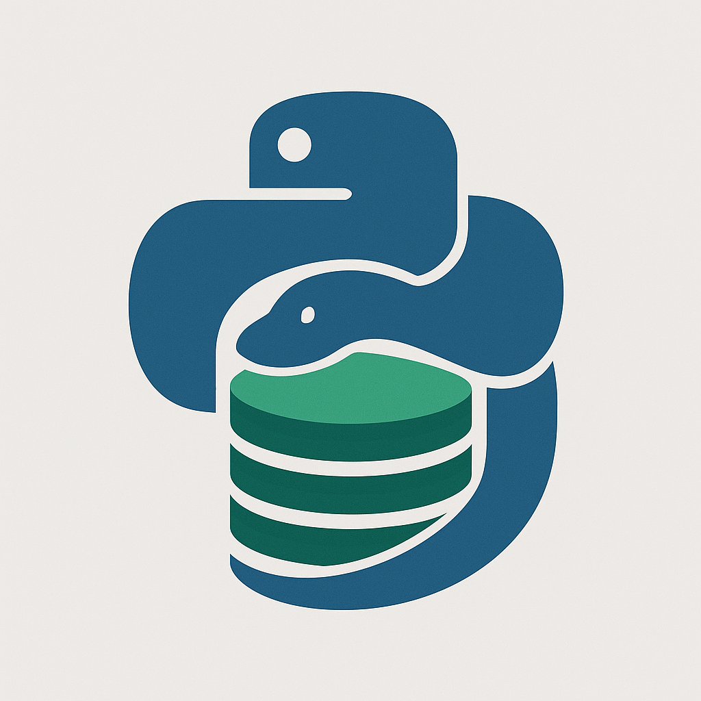

# 🌟 GestVenv v2.0

<div align="center">
  
  <br/>
  <em>Gestionnaire d'environnements virtuels Python moderne</em>
</div>

[](https://badge.fury.io/py/gestvenv)
[](https://pypi.org/project/gestvenv/)
[](https://github.com/gestvenv/gestvenv/actions)
[](https://codecov.io/gh/gestvenv/gestvenv)
[](https://opensource.org/licenses/MIT)

## 🎉 Nouveautés v2.0

### 🚀 Environnements Éphémères
- **Context managers Python** : Création et nettoyage automatique
- **Isolation avancée** : 4 niveaux (process, namespace, container, chroot)
- **Monitoring temps réel** : CPU, mémoire, disque
- **Storage optimisé** : tmpfs, memory pour performance maximale

### 🔌 Extension VS Code Native
- **IntelliSense** pour packages Python installés
- **Auto-complétion** intelligente et contextuelle
- **Language Server Protocol** complet
- **WebSocket** pour synchronisation temps réel
- **Refactoring** assisté et code actions

### 🌐 Interface Web Moderne
- **Dashboard Vue 3** avec Tailwind CSS
- **API REST** complète avec FastAPI
- **WebSocket** pour updates temps réel
- **Gestion visuelle** des environnements et packages

### ⚡ Alias de commande
- Utilisez `gestvenv` ou `gv` indifféremment

## 🚀 Fonctionnalités

### 🏗️ Création d'Environnements
- **🔥 Performance** : 10x plus rapide avec le backend uv
- **📋 Templates avancés** : Django, FastAPI, Data Science, CLI
- **🔄 Import multi-format** : pyproject.toml, conda, Pipfile, requirements.txt
- **🎯 Auto-détection** : Backend optimal selon le projet

### 📦 Gestion des Packages
- **📊 Groupes de dépendances** : Support PEP 621 complet
- **💾 Cache intelligent** : Mode hors ligne avec compression
- **🔄 Synchronisation** : Sync automatique pyproject.toml
- **⚡ Téléchargements parallèles** : Installation optimisée

### 🔧 Outils Avancés
- **🩺 Diagnostic complet** : Détection et réparation auto
- **🐚 Intégration shell** : Commandes run/shell intégrées
- **⚙️ Configuration flexible** : Locale + variables d'environnement
- **📊 Monitoring santé** : État détaillé des environnements

### 🚀 Environnements Éphémères
- **⚡ Création ultra-rapide** : < 1 seconde avec uv
- **🧹 Nettoyage automatique** : Context managers Python
- **🔒 Isolation sécurisée** : Process, namespace, container, chroot
- **📊 Monitoring temps réel** : CPU, mémoire, disque
- **💾 Stockage optimisé** : tmpfs, mémoire pour performance max

### 🌉 Migration
- **🔄 Import Pipenv** : Migration transparente depuis Pipfile
- **🐍 Support Conda** : Import environment.yml
- **📋 Export multi-format** : JSON, requirements, pyproject.toml
- **🔗 Compatibilité totale** : Avec v1.x et autres outils

## ⚡ Installation

```bash
# Installation standard
pip install gestvenv

# Avec performances optimisées
pip install gestvenv[performance]

# Installation complète (recommandée)
pip install gestvenv[full]

# Pour développeurs avec extension VS Code
pip install gestvenv[dev]
```

## 🎯 Utilisation Rapide

### Création d'environnements

```bash
# Environnement basique (utilise 'gv' ou 'gestvenv')
gv create monapp

# Depuis templates intégrés
gv create-from-template django monwebapp
gv create-from-template data-science monanalyse
gv create-from-template fastapi monapi

# Import depuis projets existants
gv create-from-pyproject ./pyproject.toml monapp
gv create-from-conda ./environment.yml monapp
gv import-from-pipfile ./Pipfile monapp

# Auto-détection et création
gv import ./mon-projet/pyproject.toml  # Détecte le format automatiquement
```

### Gestion avancée des packages

```bash
# Installation avec groupes de dépendances
gv install requests flask --env monapp --group web
gv install pytest black --env monapp --group dev

# Listage par groupes
gv list-packages --env monapp --group dev

# Synchronisation automatique
gv sync monapp --groups dev,test --clean

# Mise à jour intelligente
gv update --env monapp --all
```

### Cache intelligent et mode hors ligne

```bash
# Pré-téléchargement depuis requirements
gv cache add -r requirements.txt --python-version 3.11

# Export/import de cache
gv cache export /backup/cache.tar.gz --compress
gv cache import /backup/cache.tar.gz --verify

# Mode hors ligne complet
gv --offline create monapp
gv --offline install requests --env monapp
```

### Environnements éphémères

```python
# API Python avec nettoyage automatique
import asyncio
from gestvenv import ephemeral

async def test_package():
    async with ephemeral("test-env") as env:
        await env.install(["requests", "pandas"])
        result = await env.execute("python -c 'import requests; print(requests.__version__)'")
        print(result.stdout)
        # Cleanup automatique garanti

# Exécution
asyncio.run(test_package())
```

```bash
# CLI pour tests rapides
gv ephemeral create test --interactive --packages "requests,pandas"
gv ephemeral list
gv ephemeral stats
gv ephemeral cleanup --all
```

### Extension VS Code

```bash
# Installation de l'extension
cd extensions/vscode
npm install
npm run package

# Dans VS Code
# 1. Ouvrir le gestionnaire d'extensions
# 2. "Install from VSIX..."
# 3. Sélectionner gestvenv-vscode-x.x.x.vsix
```

### Interface Web

```bash
# Démarrer l'interface web
cd web
./start-dev.sh

# Accéder à http://localhost:5173
```

### Diagnostic et réparation

```bash
# Diagnostic complet
gv doctor --full --performance

# Réparation automatique
gv doctor --auto-fix
gv repair monapp --all

# Nettoyage du système
gv cleanup --orphaned --cache
```

### Configuration avancée

```bash
# Configuration globale
gv config set preferred_backend uv
gv config set cache_size_mb 2000

# Configuration locale du projet
gv config set --local preferred_backend poetry

# Variables d'environnement
export GESTVENV_BACKEND=uv
export GESTVENV_CACHE_ENABLED=true
```

### Intégration shell

```bash
# Exécution dans l'environnement
gv run --env monapp python mon_script.py
gv run --env monapp pytest tests/

# Shell interactif
gv shell --env monapp

# Activation classique
gv activate monapp
```

## 📊 Performance et Backends

| Backend | Installation | Résolution | Cache | Groupes | Lock Files | Auto-détection |
|---------|-------------|------------|-------|---------|------------|----------------|
| **uv**  | 🔥🔥🔥      | 🔥🔥🔥     | 🔥🔥🔥 | ✅       | ✅         | ✅             |
| **PDM** | 🔥🔥🔥      | 🔥🔥🔥     | 🔥🔥🔥 | ✅       | ✅         | ✅             |
| poetry  | 🔥🔥        | 🔥🔥       | 🔥🔥  | ✅       | ✅         | ✅             |
| pip     | 🔥          | 🔥         | 🔥    | ✅       | ❌         | ✅             |

### Templates Intégrés

| Template | Description | Dépendances | Structure |
|----------|-------------|-------------|-----------|
| **django** | Projet Django moderne | Django 4.2+, environ, psycopg2 | Apps, settings, URLs |
| **fastapi** | API REST performante | FastAPI, SQLAlchemy, Alembic | Modèles, routeurs, DB |
| **data-science** | Analyse de données | Pandas, NumPy, Jupyter, Scikit-learn | Notebooks, pipelines ML |
| **cli** | Outil en ligne de commande | Click, Rich, Typer | Commands, utils |
| **basic** | Projet Python standard | Minimal | Structure basique |

## 🗂️ Structure de projet supportée

```
mon-projet/
├── pyproject.toml          # Configuration principale (PEP 621)
├── requirements.txt        # Support legacy
├── .gestvenv/             # Cache et configuration
│   ├── environments/      # Environnements virtuels
│   ├── cache/            # Cache packages
│   └── ephemeral/        # Environnements temporaires
├── extensions/           # Extensions IDE
│   └── vscode/          # Extension VS Code
├── web/                 # Interface web
│   ├── api/            # API REST/WebSocket
│   └── web-ui/         # Interface Vue 3
└── src/                # Code source
```

## 🔧 Configuration

### Configuration globale

```toml
# ~/.config/gestvenv/config.toml
[general]
preferred_backend = "uv"
default_python = "3.11"
auto_cleanup = true

[cache]
enabled = true
size_mb = 2000
compression = "zstd"

[ephemeral]
default_isolation = "namespace"
default_storage = "tmpfs"
auto_cleanup_seconds = 3600

[ide]
vscode_extension = true
intellisense_enabled = true
```

### Configuration projet

```toml
# .gestvenv/config.toml
[project]
name = "mon-projet"
backend = "uv"
python_version = "3.11"

[dependencies]
groups = ["main", "dev", "test", "docs"]
```

## 🔄 Migration depuis v1.x

```bash
# Migration automatique
gv migrate --from-v1

# Import manuel
gv import-v1-environments ~/.gestvenv-v1/
```

## 🩺 Diagnostic et maintenance

```bash
# Diagnostic complet
gv doctor --full --json

# Réparation automatique
gv repair --env monapp --deep

# Nettoyage système
gv cleanup --all --force
```

## 📚 Documentation

- [Guide d'installation](docs/installation.md)
- [Démarrage rapide](docs/quickstart.md) 
- [Guide utilisateur](docs/user_guide/)
- [Environnements éphémères](docs/ephemeral-environments.md)
- [Extension VS Code](docs/vscode-extension.md)
- [API Web](docs/web-api.md)
- [Migration v1.x → v2.0](docs/migration-v2.md)
- [Documentation API](docs/api/)

## 🔧 Développement

```bash
# Cloner le projet
git clone https://github.com/gestvenv/gestvenv.git
cd gestvenv

# Installation développement
pip install -e .[dev]

# Tests complets
pytest --cov=gestvenv --cov-report=html

# Linting et formatage
pre-commit run --all-files

# Build extension VS Code
cd extensions/vscode
npm run package

# Lancer l'interface web
cd web
./start-dev.sh
```

## 🤝 Contribution

Les contributions sont bienvenues ! 

1. Fork le projet
2. Créer une branche feature (`git checkout -b feature/amazing-feature`)
3. Commit les changements (`git commit -m 'Add amazing feature'`)
4. Push vers la branche (`git push origin feature/amazing-feature`)
5. Ouvrir une Pull Request

Voir [CONTRIBUTING.md](CONTRIBUTING.md) pour plus de détails.

## 📄 Licence

Ce projet est sous licence MIT. Voir [LICENSE](LICENSE) pour les détails.

## 🙏 Remerciements

- Communauté Python pour les standards PEP
- Équipes uv, poetry, PDM pour l'inspiration
- Microsoft pour VS Code Extension API
- Vue.js team pour le framework réactif
- Tous les contributeurs et utilisateurs

---

<div align="center">
  <strong>GestVenv v2.0 - L'avenir de la gestion d'environnements Python</strong>
  <br>
  <em>Maintenant avec environnements éphémères, extension VS Code et interface web!</em>
</div>
