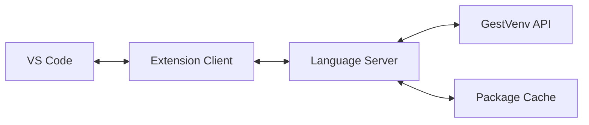
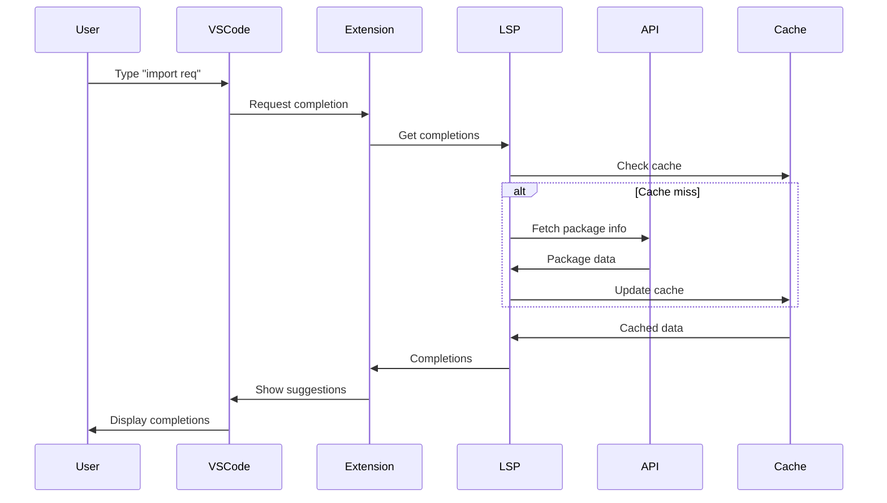

# Extension VS Code GestVenv

L'extension VS Code GestVenv offre une intégration profonde avec l'éditeur, incluant IntelliSense avancé, gestion visuelle des environnements, et synchronisation temps réel.

## Table des matières

1. [Installation](#installation)
2. [Fonctionnalités principales](#fonctionnalités-principales)
3. [IntelliSense et auto-complétion](#intellisense-et-auto-complétion)
4. [Vue arborescente](#vue-arborescente)
5. [Language Server Protocol](#language-server-protocol)
6. [Code Actions](#code-actions)
7. [Configuration](#configuration)
8. [Architecture technique](#architecture-technique)
9. [Développement](#développement)

## Installation

### Depuis le marketplace (à venir)

```bash
# Rechercher "GestVenv" dans le marketplace VS Code
# Ou via ligne de commande :
code --install-extension gestvenv.gestvenv-vscode
```

### Installation manuelle

```bash
# Cloner et builder l'extension
cd extensions/vscode
npm install
npm run package

# Installer le fichier .vsix
code --install-extension gestvenv-vscode-2.0.0.vsix
```

### Prérequis

- VS Code 1.75.0 ou supérieur
- GestVenv 2.0+ installé (`pip install gestvenv`)
- Node.js 16+ (pour le développement uniquement)

## Fonctionnalités principales

### 🔍 IntelliSense avancé

Auto-complétion intelligente pour tous les packages installés dans vos environnements :

```python
import req  # Suggestions: requests, requirements-parser
from requests import s  # Suggestions: Session, status_codes, structures
```

### 🌳 Vue arborescente

Explorateur visuel de vos environnements dans la barre latérale :

```
GESTVENV ENVIRONMENTS
├── 📦 my-project (uv)
│   ├── 🐍 Python 3.11.0
│   ├── 📋 Packages (42)
│   │   ├── django 4.2.0
│   │   ├── requests 2.31.0
│   │   └── ...
│   └── ⚙️ Backend: uv
├── 📦 data-analysis (pip)
│   └── ...
└── 🚀 Éphémères (3)
    └── test-env-a1b2c3
```

### ⚡ Commandes rapides

Palette de commandes (Ctrl/Cmd+Shift+P) :

- `GestVenv: Create Environment` - Créer un environnement
- `GestVenv: Activate Environment` - Activer pour le workspace
- `GestVenv: Install Package` - Installation rapide
- `GestVenv: Create Ephemeral` - Environnement temporaire
- `GestVenv: Sync from pyproject.toml` - Synchroniser les dépendances

### 🔄 Synchronisation temps réel

- Updates automatiques lors des changements d'environnements
- WebSocket pour notifications instantanées
- Refresh de l'IntelliSense après installation de packages

## IntelliSense et auto-complétion

### Configuration de base

L'extension détecte automatiquement l'environnement actif et configure IntelliSense :

```json
// .vscode/settings.json généré automatiquement
{
    "python.defaultInterpreterPath": "${workspaceFolder}/.gestvenv/environments/my-project/bin/python",
    "gestvenv.activeEnvironment": "my-project",
    "gestvenv.enableIntelliSense": true
}
```

### Fonctionnalités IntelliSense

#### Import suggestions

```python
# Tapez le début d'un import
import pa  # Suggestions: pandas, pathlib, paramiko, packaging

# Import depuis un package
from pandas import D  # Suggestions: DataFrame, DatetimeIndex, DateOffset
```

#### Hover information

Survolez un symbole pour voir :
- Documentation du package
- Version installée
- Dépendances
- Lien PyPI

#### Signature help

```python
requests.get(  # Affiche la signature complète avec paramètres
```

### Cache intelligent

L'extension maintient un cache des métadonnées de packages :

```typescript
// Cache structure
{
    "requests": {
        "version": "2.31.0",
        "exports": ["get", "post", "Session", ...],
        "documentation": "...",
        "lastUpdated": "2024-07-17T10:00:00Z"
    }
}
```

## Vue arborescente

### Navigation

- **Click** : Sélectionner/activer un environnement
- **Double-click** : Ouvrir les détails
- **Clic droit** : Menu contextuel avec actions

### Actions disponibles

Sur un environnement :
- ✅ Activer pour le workspace
- 📦 Installer des packages
- 🔄 Synchroniser avec pyproject.toml
- 🗑️ Supprimer l'environnement
- 📊 Voir les statistiques

Sur un package :
- 🔄 Mettre à jour
- 🗑️ Désinstaller
- 📖 Ouvrir la documentation
- 🔗 Voir sur PyPI

### Indicateurs visuels

- 🟢 Environnement actif
- 🟡 Mise à jour disponible
- 🔴 Erreur ou problème
- ⚡ Environnement éphémère

## Language Server Protocol

### Architecture LSP

L'extension implémente un serveur LSP complet :

```typescript
// Capacités supportées
{
    "completionProvider": {
        "resolveProvider": true,
        "triggerCharacters": [".", " ", "from", "import"]
    },
    "hoverProvider": true,
    "signatureHelpProvider": {
        "triggerCharacters": ["(", ","]
    },
    "codeActionProvider": true,
    "documentSymbolProvider": true
}
```

### Communication



### Performances

- Démarrage du serveur : < 500ms
- Complétion : < 50ms (depuis cache)
- Hover : < 30ms
- Updates via WebSocket : temps réel

## Code Actions

### Installation rapide

Cliquez sur l'ampoule 💡 pour :

```python
import unknown_package  # 💡 Install 'unknown_package' with GestVenv
```

### Import manquants

```python
df = DataFrame()  # 💡 Add import: from pandas import DataFrame
```

### Refactoring suggestions

```python
# Code avec imports non utilisés
import os  # 💡 Remove unused import
import sys

def hello():
    print("Hello")
```

### Environnements virtuels

```python
# Au début d'un fichier
# 💡 No active environment. Create one with GestVenv?
```

## Configuration

### Settings.json

```json
{
    // Environnement par défaut
    "gestvenv.defaultEnvironment": "my-project",
    
    // Backend préféré
    "gestvenv.preferredBackend": "uv",
    
    // IntelliSense
    "gestvenv.enableIntelliSense": true,
    "gestvenv.intelliSense.cacheTimeout": 3600,
    "gestvenv.intelliSense.maxSuggestions": 100,
    
    // Auto-complétion
    "gestvenv.autoComplete.addParentheses": true,
    "gestvenv.autoComplete.includePrivate": false,
    
    // WebSocket
    "gestvenv.enableWebSocket": true,
    "gestvenv.webSocketUrl": "ws://localhost:8000/ws",
    
    // Affichage
    "gestvenv.showEnvironmentInStatusBar": true,
    "gestvenv.treeView.showPackageVersions": true,
    "gestvenv.treeView.groupByCategory": false
}
```

### Variables d'environnement

```bash
# .env ou variables système
GESTVENV_API_URL=http://localhost:8000
GESTVENV_WEBSOCKET_URL=ws://localhost:8000/ws
GESTVENV_CACHE_DIR=/tmp/gestvenv-vscode-cache
```

### Workspace settings

```json
// .vscode/settings.json du projet
{
    "gestvenv.activeEnvironment": "${workspaceFolderBasename}",
    "gestvenv.autoActivate": true,
    "gestvenv.syncOnSave": true
}
```

## Architecture technique

### Structure du projet

```
extensions/vscode/
├── src/
│   ├── extension.ts          # Point d'entrée
│   ├── api/                  # Client API GestVenv
│   │   ├── client.ts        # REST client
│   │   └── websocket.ts     # WebSocket client
│   ├── providers/           # Providers VS Code
│   │   ├── completion.ts    # Auto-complétion
│   │   ├── hover.ts        # Hover information
│   │   └── codeAction.ts   # Code actions
│   ├── views/              # Tree views
│   │   └── environmentTree.ts
│   ├── lsp/               # Language Server
│   │   ├── server.ts      # LSP server
│   │   └── client.ts      # LSP client
│   └── cache/             # Cache management
│       └── packageCache.ts
├── package.json           # Manifest
├── tsconfig.json         # TypeScript config
└── webpack.config.js     # Build config
```

### Flow de données



### WebSocket Events

```typescript
// Events entrants
interface IncomingEvents {
    'environment:created': { environment: Environment };
    'environment:updated': { environment: Environment };
    'environment:deleted': { environmentId: string };
    'package:installed': { environmentId: string; package: Package };
    'package:uninstalled': { environmentId: string; packageName: string };
}

// Events sortants
interface OutgoingEvents {
    'subscribe': { environmentId: string };
    'unsubscribe': { environmentId: string };
    'refresh': { environmentId?: string };
}
```

## Développement

### Setup développement

```bash
# Clone et installation
git clone https://github.com/gestvenv/gestvenv
cd gestvenv/extensions/vscode
npm install

# Développement avec hot reload
npm run watch

# Dans VS Code : F5 pour lancer une instance de test
```

### Tests

```bash
# Tests unitaires
npm test

# Tests d'intégration
npm run test:integration

# Coverage
npm run test:coverage
```

### Build et packaging

```bash
# Build de production
npm run compile

# Créer le package VSIX
npm run package

# Publier (avec vsce)
npm run publish
```

### Debug

Pour debugger l'extension :

1. Ouvrir le projet dans VS Code
2. Aller dans l'onglet "Run and Debug"
3. Sélectionner "Launch Extension"
4. F5 pour démarrer

Points de debug utiles :
- `extension.ts:activate()` - Activation
- `providers/completion.ts` - Auto-complétion
- `lsp/server.ts` - Language Server

### Contribution

1. Fork le repository
2. Créer une branche feature
3. Implémenter avec tests
4. Soumettre une PR

Guidelines :
- TypeScript strict mode
- Tests pour toute nouvelle fonctionnalité
- Documentation JSDoc
- Respect du style de code (ESLint)

## Troubleshooting

### L'extension ne s'active pas

1. Vérifier que GestVenv est installé : `gv --version`
2. Vérifier les logs : "Output" > "GestVenv"
3. Recharger VS Code : Cmd/Ctrl+Shift+P > "Reload Window"

### IntelliSense ne fonctionne pas

1. Vérifier qu'un environnement est actif
2. Vider le cache : Cmd/Ctrl+Shift+P > "GestVenv: Clear Cache"
3. Vérifier les settings Python

### WebSocket déconnecté

1. Vérifier que l'API est lancée : `curl http://localhost:8000/health`
2. Vérifier l'URL dans les settings
3. Voir les logs réseau dans la console développeur

## Changelog

### v2.0.0 (2024-07-17)
- Version initiale avec l'extension VS Code
- IntelliSense complet pour packages Python
- Vue arborescente des environnements
- Language Server Protocol
- WebSocket pour synchronisation temps réel
- Code actions pour installation rapide

### Roadmap v2.1
- Debugger integration
- Jupyter notebook support
- Remote development support
- Multi-root workspace support
- Performance profiling tools